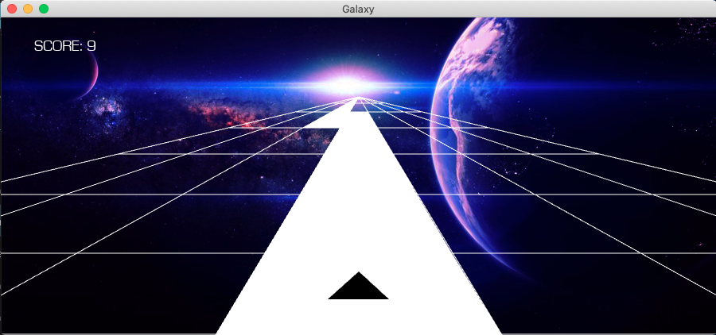

# Galaxy

## Description:
#### Welcome to Galaxy! Cadet, put your helmet on and be ready to be brought back to the 80's Video Game Arcades!
#### This project has been part of the learning process of the kivy framework.
## Technologies:
#### Language: Python 3.11.1
#### Framework: kivy 2.2.0
#### In order to run the application please:
#### • clone the repository
#### • download [Python](https://www.python.org/downloads/) if not already done
#### • download [kivy](https://kivy.org/doc/stable/gettingstarted/installation.html) framework and the required dependencies
#### • if your kivy version is different please modify the galaxy.kv and menu.kv files accordingly

## Usage:
#### Once the app is running you can press the start button.
#### The starship can be moved left and right using the arrow keys or if on mobile device by touching the left or right side of the touchscreen.

## Sources:
#### • [Kivy Course - Create Python Games and Mobile Apps](https://www.youtube.com/watch?v=l8Imtec4ReQ&t=18698s) by Jonathan Roux (freeCodeCamp)

